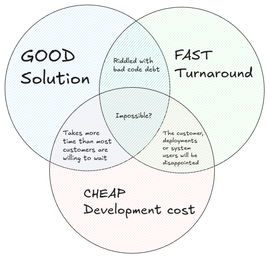

My role as product specialist at work involves working together with both our
developers, and with the service and deployments teams that work more directly
with our customers. When we work through and deploy a fix or a feature,
we have to trust that the solution being presented to us by the devs is the 
"best" option available at the time. 

It is of course important to trust your team, but its equally important to make 
sure that you fully understand (and agree with) why a particular solution was 
chosen. This includes knowing what alternatives were available, 
the technical challenges involved in those alternatives and what caveats all of
those hold for the end user.

## Understanding Impact

This diagram roughly illustrates the considerations and tradeoffs that we must 
make when helping to guide a solution:

Our work is product driven in a cottage industry, so as much as possible
we tend towards `Fast Turnaround` and `Cheap Development Cost`.

This is not out of laziness; many of our products are mature, but have not gotten
the time or resources dedicated to work out the baked in complexity of past 
decisions. A good example of this is typically seen in 'first time' features;
those which we developed to address (usually a single) customers needs. These
changes must integrate with the rest of the existing product, which will get
deployed on sites which do not have use for this change at all. So now when
working through solutions on those sites, we must consider that 'oh well
this customer is doing that one specific thing, and this change would break that
workflow'.

So the path of least resistance is to make something that 
can work within our existing model, but which doesnt add another layer of code 
debt that we can't remove in the future.

And if you're new to the team, you're likely to resist pushing back on some of 
the solutions built with this mentality, even if you arent convinced they are
the preffered solution. 

Because what do you know? All of these people have been here way longer than 
you have, surely they're making the best possible decision for the product. 

Well those decisions are not always guided in that way, and it often requires 
some bargaining with those implementing the solution. 

In general we want to aim for an outcome that falls closer between 
`Good Solution` and `Cheap Development Cost`.

The solution may take a bit longer than we'd like to implement and test, but 
if we are able to articulate the requirements, understand what the pitfalls of 
the available options are, and can communicate those effectively when looking for 
feedback, then we will arrive at a solution that has a more lasting impact on 
our users and the product.

## Asking Questions Before Escalation

A couple of weeks ago, I had a more junior member of the team come to me for 
some input on a feature. We'll call him Dave.

I wont go into too many details on the feature itself, as its fairly bespoke, 
but on the surface Dave did everything correctly:

- He gathered feedback from the onsite team
- He setup the customer environment in house to see the issue
- He outlined the problem space in a ticket

After a week or so, one of our senior developers took on the ticket and started
getting to work. I wasnt involved here, but I know there was some back and 
forth about implementation, requirements, and discussion around how the user 
will interact with the change.

When he reached out to me, the question was: 

"We're making this a commandline argument. Should it be global, or on
a per interface basis?". 

My response was "Why is this feature a commandline argument? Is this not 
something that we can add to the web UI? If it's done via the CLI, then
how are we expecting people to know about it? What if they type the wrong
thing, we're going to tell them they have to schedule downtime to fix?".

This then led to further questions, like if the web team was engaged at all, 
why the developers think this is the only, or best, way to achieve the feature, 
how he thought the deployment of the change would go over 
(broadcast customers are generally live 24/7 and require tight overnight 
windows to apply changes to the system). 

Ultimately we both agreed he had to go back and get a little bit more 
understanding around the proposed solution, how and why its been implemented 
the way it has and if the alternatives we discussed were viable 
(and if not, why).

Dave came to me for input, and I was able to ask several questions about the 
feature for which he had no answer. This was ok, he is less experienced, and
since it was still in development and my questions in this moment have 
no immediate impact.

But the issue would arise if this feature went out without these questions 
having been asked. If it got deployed with the requirement that the user SSH 
into the server, add a commandline argument to a file and then restart a 
service. And especially if they had to do this en masse. 
The likelyhood of mistakes with anything like that is generally high,
and can cost a lot of people time and energy to diagnose and fix.

## Gaining a Sense of Ownership

Dave, at least at first, had not owned the solution. He largely trusted that 
the decisions being made were the most appropriate, and did not take the time 
to understand why it was being implemented that way, what constraints in our
system were forcing the solution down that path, and what alternatives 
could be explored outside of the box to achieve the same goal.

When we own the solution, we are able to speak to it. It becomes ours. We can 
justify it, we can rebut or negotiate alternative viewpoints around it, and we 
can confidently say that what we did seemed to be the best way to achive it 
at the time. 

If we do not do this, then the solution, and so the product, will lose 
confidence. Someone else will have to be called in to speak on it, 
because we cannot articulate why something was or was not done. 

We do not grow, because we do not learn, because we do not ask. We need to own 
the solution, because when something goes wrong we are the ones
that have to be able to speak to it.
